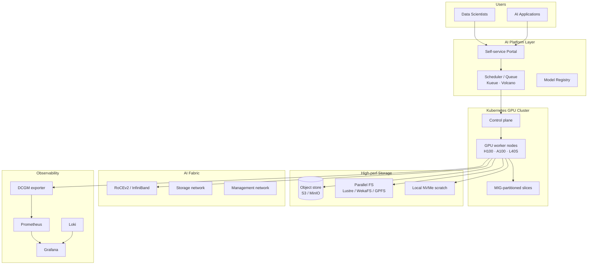

<h1 align="center">🧠 AI Infrastructure Blueprints</h1>

  <strong>Opinionated reference architectures, sizing guides, and operational checklists for AI-ready data centers, GPU platforms, and AI Kubernetes workloads.</strong>

  
  
  
  

---

## 🎯 Purpose

AI workloads need a different infrastructure mindset than traditional enterprise apps: **high-density power**, **advanced cooling**, **GPU scheduling**, **high-throughput east-west networking**, **observability that understands accelerators**, and **operational governance** for shared multi-tenant clusters.

This repository captures **reusable, opinionated blueprints** drawn from real-world AI infrastructure planning — the stuff you actually need before procurement, design freeze, and commissioning.

## 📚 Contents

### Blueprints (`blueprints/`)
- **[AI-Ready Data Center](blueprints/ai-ready-datacenter.md)** — full design checklist: power density, cooling strategy, fabric, GPU orchestration, storage, observability, governance
- **[GPU Cluster Sizing](blueprints/gpu-cluster-sizing.md)** — sizing model for training & inference clusters with worked example
- **[Liquid Cooling Planning](blueprints/liquid-cooling-planning.md)** — DLC vs immersion, hydraulics, leak detection, retrofit considerations
- **[AI Network Fabric](blueprints/ai-network-fabric.md)** — RoCE/InfiniBand fabric design, oversubscription ratios, topology choices

### Checklists (`checklists/`)
- **[AI DC Readiness](checklists/ai-dc-readiness.md)** — go/no-go for AI-ready DC commissioning
- **[GPU Cluster Day-2 Ops](checklists/gpu-cluster-day2-ops.md)** — monitoring, capacity, lifecycle

### Examples (`examples/`)
- **[K8s GPU Scheduling](examples/k8s-gpu/)** — namespaces, ResourceQuota, PriorityClass, GPU node selectors, MIG examples

### Diagrams (`diagrams/`)
- Mermaid sources for inclusion in design docs

## 🏗️ Reference Architecture

## 🎓 Who This Is For

- **Solution architects** designing AI infrastructure for greenfield or brownfield projects
- **Data center operators** preparing existing facilities for GPU workloads
- **Platform engineers** building shared GPU Kubernetes clusters
- **Presales consultants** producing AI infrastructure proposals
- **CIOs / CTOs** validating vendor proposals against independent reference designs

## ⚠️ Disclaimer

These are **planning blueprints**, not vendor-validated designs. Always validate against your specific hardware vendor's reference architecture and your facility's electrical / mechanical engineer of record before commitment.

## 🗺️ Roadmap

- [ ] LLM inference cost model
- [ ] Multi-tenant GPU isolation patterns
- [ ] AI workload observability dashboard pack
- [ ] Sustainable AI infrastructure (renewable, heat-reuse)
- [ ] AI infrastructure security baseline

## 📄 License

[MIT](LICENSE) © Mohammed Abood
