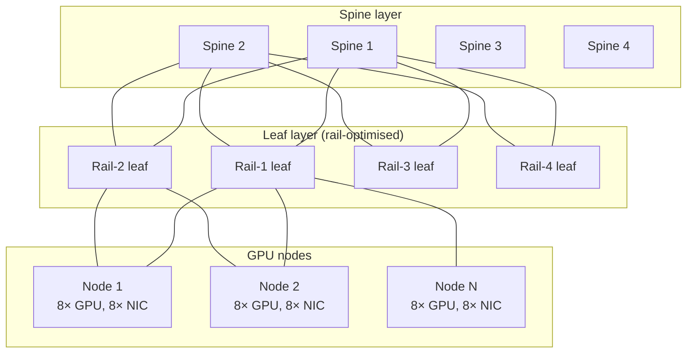

# AI Network Fabric Design

> The training fabric is the highest-stakes design decision in an AI cluster. Get it wrong and every job in the cluster pays the tax.

## Why traditional DC fabrics fail for AI training

| Enterprise DC fabric | AI training fabric |
|---|---|
| North-south dominant (client → server) | East-west dominant (GPU ↔ GPU) |
| Bursty traffic | Sustained, synchronized bursts (all-reduce) |
| Tolerant of TCP retransmits | Tail latency dominates job time |
| 25–100 G typical | 400–800 G per GPU; multi-rail per node |
| Oversubscription 4:1 acceptable | 1:1 required at scale |

## Three credible choices in 2025

| Fabric | Vendor anchor | Strengths | Weaknesses |
|---|---|---|---|
| **InfiniBand (NDR 400G / XDR 800G)** | NVIDIA Mellanox | Highest sustained throughput; RDMA-native; SHARP collectives offload | Vendor lock; less operator skill in market |
| **RoCEv2 over Ethernet (lossless)** | Broadcom (Tomahawk 5), NVIDIA (Spectrum-X), Arista, Cisco | Operates with existing Ethernet skills; multi-vendor | Lossless tuning (PFC, ECN) is delicate |
| **NVIDIA NVLink Switch / NVL72** | NVIDIA | Highest GPU↔GPU bandwidth; in-cabinet | Limited blast radius; expensive |

**Heuristic:** if you're standing up your first medium-scale AI cluster (≤ 256 GPUs) inside an Ethernet-native org, **RoCEv2 with Spectrum-X or equivalent is the safest bet**. For very large training (1k+ GPUs) and uncompromising scaling, **InfiniBand** is still the default in most public reference designs.

## Topology

**Rail-optimised topology** — each GPU's NIC connects to the *same-numbered* leaf across all nodes. This collapses all-reduce traffic onto deterministic paths and dramatically reduces hot-spotting versus generic fat-tree.

## Oversubscription

| Cluster role | Oversubscription |
|---|---|
| Training fabric (GPU ↔ GPU) | **1:1** (non-blocking) |
| Storage fabric (GPU ↔ parallel FS) | 2:1 acceptable |
| Management plane | 4:1 or higher acceptable |
| Out-of-band | 1 Gbps copper is fine |

Anything above 1:1 on the training fabric **caps job size** — it's a permanent constraint, not a tuneable one.

## Lossless Ethernet (RoCEv2) — what actually matters

1. **PFC (Priority Flow Control)** on the RDMA traffic class
2. **ECN (Explicit Congestion Notification)** to throttle senders before drops
3. **DCQCN tuning** — out of the box settings rarely fit; expect 1–2 weeks of iteration
4. **Buffer sizing** — switch ASIC buffer per port × number of hops
5. **Adaptive routing** — Spectrum-X / Tomahawk 5 features; legacy ECMP causes hash collisions
6. **Telemetry** — INT/IFA or vendor equivalent; you need to *see* microbursts

## Storage fabric

Separate or converged? Two reasonable patterns:

- **Separate** — dedicated storage NICs (typically 200 G); cleaner congestion isolation; more cabling
- **Converged** — storage traffic shares the compute fabric on different QoS class; less hardware; tuning is harder

For large training clusters, **separate** is the conservative choice.

## Validation gates

Before declaring fabric ready for production:

- [ ] `nccl-tests` (`all_reduce_perf`, `all_gather_perf`) at design BW across all node counts up to full cluster
- [ ] 24-hour soak with synthetic all-reduce — no PFC pause storms, no retransmits, no XID errors
- [ ] Single-link failure test — fabric reconverges, jobs continue
- [ ] Single-leaf failure test — partial blast radius, expected pods/jobs preserved
- [ ] Microburst visibility — telemetry captures sub-second congestion events
- [ ] Cable map verified — labelled, documented, signed by network ops

## Common pitfalls

- Buying GPU servers before finalising the fabric design → connector and NIC mismatches
- Treating the fabric as "just Ethernet" → lossless tuning eats months
- Mixing 200 G and 400 G in the same rail → hash collisions, asymmetric throughput
- Skipping rail-optimised cabling because it's annoying → hot-spots in production
- Designing for the **current** GPU generation only → next-gen NICs are 800 G and you'll re-cable
